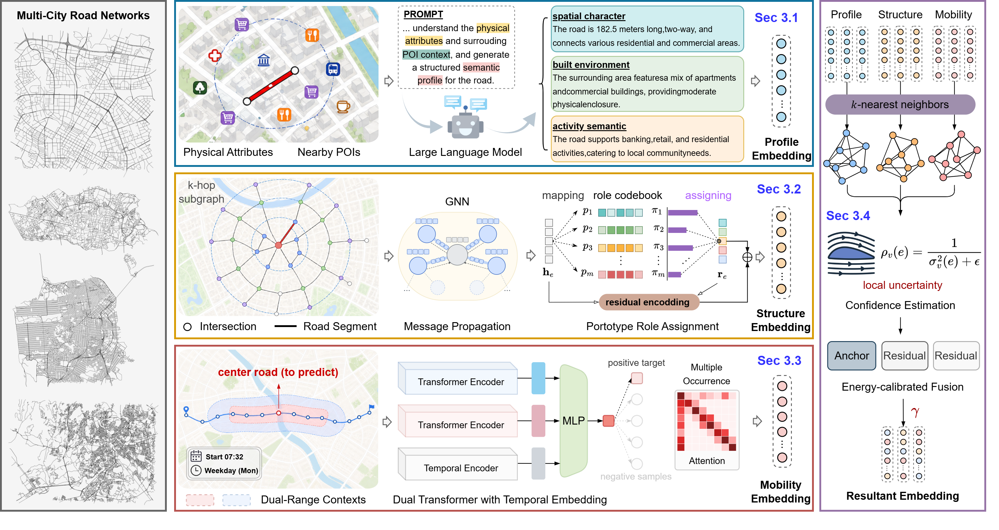

# UniRoad

Unifying Road Representations Across Cities and Tasks.



## Overview

This codebase follows the paper logic with four components:

- `Profile view`: LLM-based road functional profiling and text embedding
- `Structure view`: prototype-based local topology representation learning
- `Mobility view`: trajectory-informed temporal context representation learning
- `Fusion`: confidence-guided multi-view integration (EC-auto)

## Repository Structure

```text
UniRoad-Github/
├─ models/
│  ├─ profile/      # profile generation + profile embeddings
│  ├─ structure/    # prototype-based structure branch
│  ├─ mobility/     # trajectory-based mobility branch
│  └─ fusion/       # core EC-auto fusion
├─ tasks/           # downstream tasks (classification/regression/trajectory)
├─ utils/           # shared graph/data utilities
├─ scripts/         # train/readout/evaluation entry scripts
├─ data/            # city datasets
├─ requirements.txt
└─ README.md
```

## Data Format

Each city directory under `data/<city>/` should include:

- `G_nodes.csv`, `G_edges.csv`
- `trajectories.csv`
- `road_types.npy`, `road_speeds.npy`

Supported cities in current experiments: `chengdu`, `porto`, `rome`, `sanfran`.

## Data Download (External)

The dataset is large and is not suitable for GitHub hosting. It is distributed via external cloud storage.

- Google Drive download link: [data_release.tar.zst](https://drive.google.com/file/d/18EoVn9Ll5oZHhF4bXk8Mec2ax9vH_p0P/view?usp=sharing)
- Suggested package name: `data_release.tar.zst`

Download and extract:

```bash
# download data_release.tar.zst to repo root first
tar --zstd -xf data_release.tar.zst
```

After extraction, ensure the directory layout is:

```text
data/
├─ chengdu/
├─ porto/
├─ rome/
└─ sanfran/
```

## Environment

```bash
pip install -r requirements.txt
```

For profile generation/embedding API calls, prepare `.env`:

```bash
OpenRouter_API_KEY=...
```

## Training and Readout

### 1) Structure Branch

```bash
python scripts/train_structure.py train \
  --scope joint \
  --joint-cities chengdu,porto,rome,sanfran \
  --joint-id joint4 \
  --data-root data --ckpt-root ckpts \
  --device cuda --max-epoch 200 --batch-size 64 \
  --train-tag structure_joint4_e200

python scripts/train_structure.py readout \
  --model-pt ckpts/structure/structure_joint4_e200/best.pt \
  --trg-city chengdu --data-root data --emb-root embs \
  --device cuda --train-tag structure_joint4_e200
```

### 2) Mobility Branch

```bash
python scripts/train_mobility.py train \
  --cities chengdu,porto,rome,sanfran \
  --src-id joint4 --data-root data --ckpt-root ckpts \
  --device cuda --max-epoch 100 --batch-size 128 \
  --train-tag mobility_joint4_e100

python scripts/train_mobility.py readout \
  --model-pt ckpts/mobility_debug/mobility_joint4_e100/best.pt \
  --trg-city chengdu --data-root data --emb-root embs \
  --device cuda --train-tag mobility_joint4_e100
```

### 3) Profile Branch

```bash
python scripts/generate_profile.py --city chengdu --platform OpenRouter --model gpt-4o-mini
python scripts/embed_profile.py --city chengdu --platform OpenRouter --model emb-3s
```

Profile embedding output: `embs/profile/<city>/z.npy`.

## Fusion

```bash
python scripts/fuse_views.py \
  --cities chengdu,porto,rome,sanfran \
  --src-id joint4 \
  --emb-root embs \
  --out-root embs/fusion
```

Expected input layout:

```text
embs/
├─ profile/<city>/z.npy
├─ structure/<src_id>__to__<city>/z.npy
└─ mobility/<src_id>__to__<city>/z.npy
```

## Downstream Evaluation (Final Fused Embedding Only)

After three-view readout and fusion, use the unified embedding for all four tasks:

- `Road type classification`
- `Road speed inference`
- `Trajectory travel time estimation`
- `Trajectory similarity search`

Single-city evaluation example:

```bash
python scripts/eval_structure.py \
  --city chengdu \
  --emb-path embs/fusion/joint4__to__chengdu/z.npy \
  --data-root data \
  --device cuda \
  --traj-task both
```

Evaluate all four cities after joint training:

```bash
for city in chengdu porto rome sanfran; do
  python scripts/eval_structure.py \
    --city ${city} \
    --emb-path embs/fusion/joint4__to__${city}/z.npy \
    --data-root data \
    --device cuda \
    --traj-task both
done
```

## Reproducibility Notes

- Keep fixed seeds in train/eval scripts.
- Structure and mobility encoders are self-supervised (no road labels in encoder loss).
- City caches are generated in `data/<city>/cache/`.

